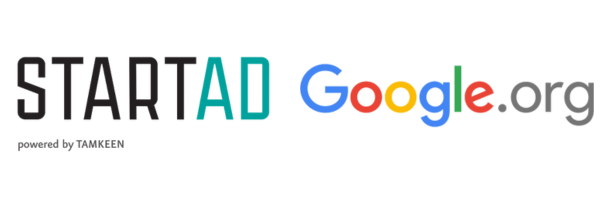
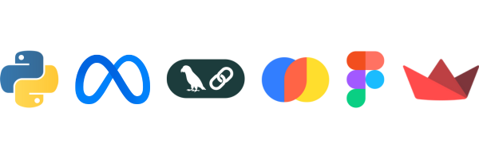

  

<h1 align="center"> MUSANID (مُساند): AI-Powered Clinical Assistant for Mental Health Care </h1>

  

  <b>Developed as part of the <a href="https://startad.ae/programs/ai-sandbox/">startAD AI for Good Sandbox</a> with support from Google.org</b>

---

### 🌟 Overview  
**MUSANID** is an AI-powered assistant designed to support therapists throughout the **assessment** and **treatment** process.
It streamlines mental health care by providing adaptive, intelligent, and time-saving tools.

### 🔹 Key Features

  ## Adaptive Questionnaires
  Guides patients through dynamic assessments that adjust in real time based on responses, reducing time and focusing on relevant symptoms.
  
  ## Severity Assessment
  Evaluates responses to estimate condition severity (e.g., mild, moderate, severe) using official diagnostic metrics.
  
  ## Treatment Recommendations
  Suggests evidence-based treatment plans tailored to each patient’s needs through a **Retrieval-Augmented Generation (RAG)** approach.
  
  ## Automated Summaries
  Creates clear summaries of patient files, assessments, and therapist notes, providing a full picture of progress and history.

---

### 🎯 Goal

Empower mental health professionals with intelligent tools that enhance decision-making, improve diagnostic accuracy, and free up time for what matters most — **patient care**.

---

### 🧩 Built with:

  
  
- **Python**: Core development language  
- **LangChain**: Manages RAG pipeline and LLM workflow  
- **LLaMA 3**: Powers question generation, summarization, and treatment reasoning  
- **ChromaDB**: Handles vector storage and document retrieval  
- **Streamlit**: Provides an interactive web interface
- **Figma**: Used for UI/UX design and prototyping  

---

### 🚀 Try the Prototype  

  

---

### Acknowledgments  
Developed by the **MUSANID Team**  
Part of the **startAD AI for Good Sandbox**, supported by **Google.org**

---

###  License  
This project is open source under the [MIT License](LICENSE).

